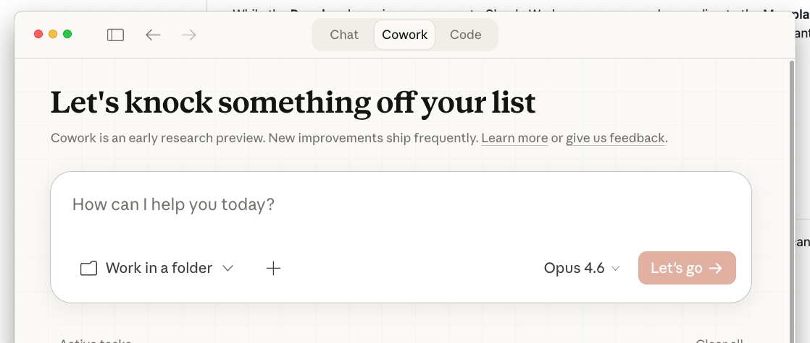
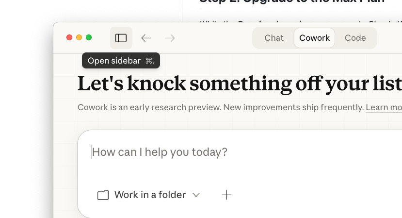
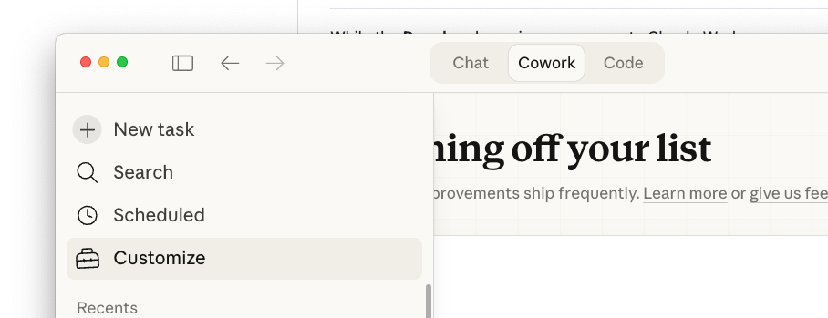
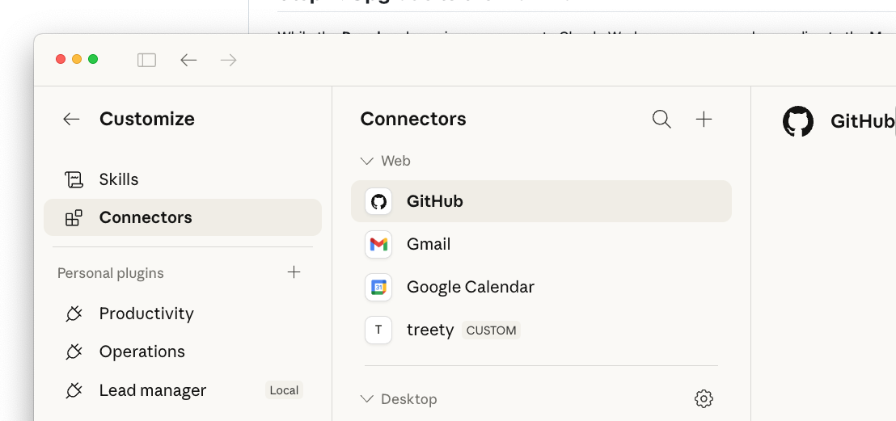
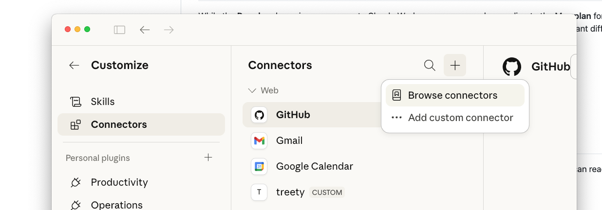
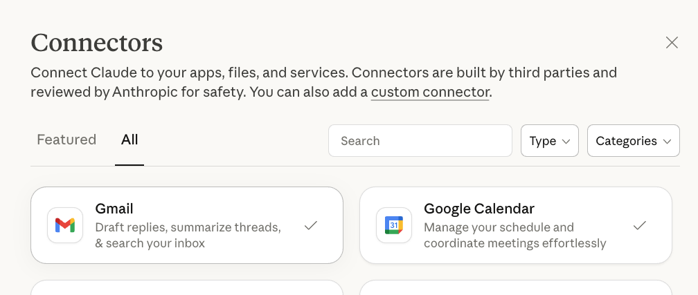
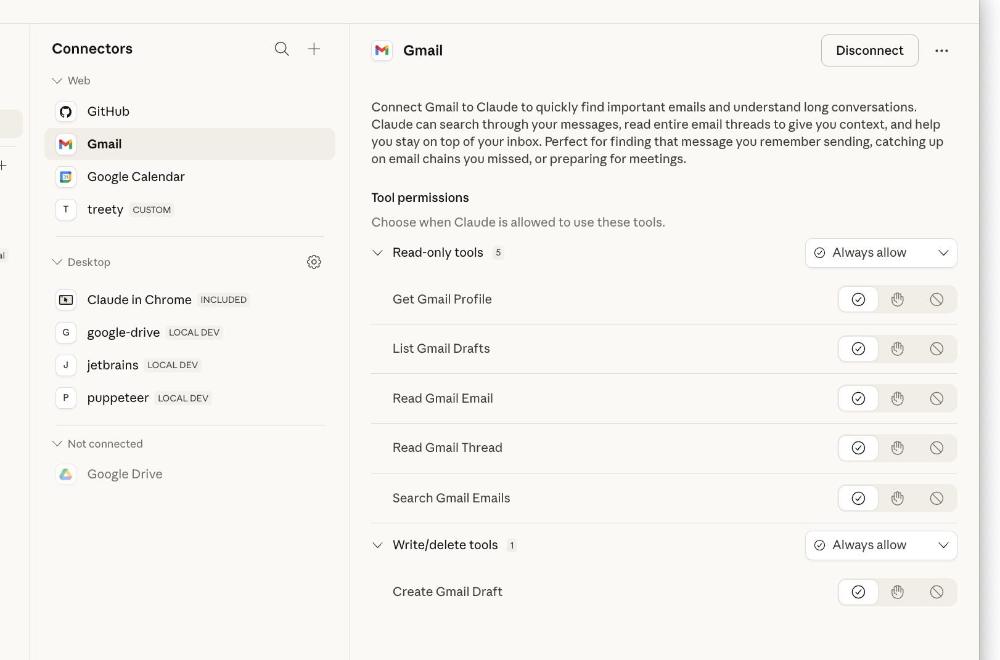
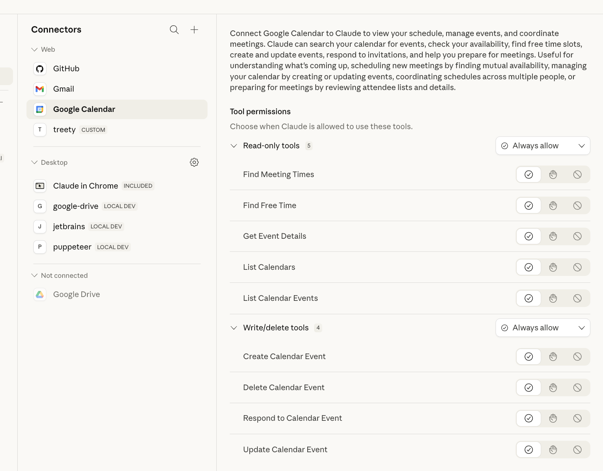

# Getting Started with Claude Desktop & Claude Works

## Step 1: Download the Claude Desktop App

1. Go to [https://claude.com/download](https://claude.com/download)
2. Download the installer for your operating system (macOS, Windows, or Linux)
3. Run the installer and follow the on-screen prompts
4. Once installed, open the **Claude desktop app** and sign in with your account

## Step 2: Upgrade to the Max Plan

While the **Pro plan** does give you access to Claude Works, we recommend upgrading to the **Max plan** for the best experience. The Max plan provides higher usage limits and priority access, which makes a significant difference when using Claude Code and Claude Works together for extended sessions.

To upgrade:
1. Go to your account settings at [claude.ai](https://claude.ai)
2. Navigate to your subscription/billing section
3. Select the **Max plan** and complete the upgrade

## Step 3: Navigate to the Cowork Tab

Once you're in the Claude desktop app, you'll see three tabs at the top: **Chat**, **Cowork**, and **Code**. Click on the **Cowork** tab — this is where Claude Works lives.

> **Important:** Make sure you are working in the **Cowork** tab (the middle tab) for all Claude Works features. This is where your connected tools and connectors are available.

## Step 4: Set Up Gmail and Calendar Connectors

### Open the Sidebar

Click the sidebar icon (top-left) or press `Cmd + .` to open the sidebar.

### Go to Customize

In the sidebar, click on **Customize** to access connector settings.

### Open Connectors

Click on **Connectors** in the left menu. You'll see your currently connected services listed under "Web".

### Add New Connectors

Click the **+** button at the top of the Connectors panel. You'll see options to **Browse connectors** or **Add custom connector**.

### Browse and Enable Gmail & Google Calendar

Select **Browse connectors** to see all available connectors. Find **Gmail** and **Google Calendar** and enable them. A checkmark indicates they are connected.

- **Gmail** — Draft replies, summarize threads, & search your inbox
- **Google Calendar** — Manage your schedule and coordinate meetings effortlessly

### Configure Gmail Permissions

Once Gmail is connected, you can configure its permissions. You'll see read-only tools (Get Gmail Profile, List Gmail Drafts, Read Gmail Email, Read Gmail Thread, Search Gmail Emails) and write tools (Create Gmail Draft).

### Configure Google Calendar Permissions

Similarly, configure Google Calendar permissions. Read-only tools include Find Meeting Times, Find Free Time, Get Event Details, List Calendars, and List Calendar Events. Write tools include Create, Delete, Respond to, and Update Calendar Events.

---

You're all set! With the Claude desktop app installed, the Max plan active, and your Gmail and Calendar connectors configured, you can start using Claude to manage your emails, schedule, and more — all in one place from the **Cowork** tab.
